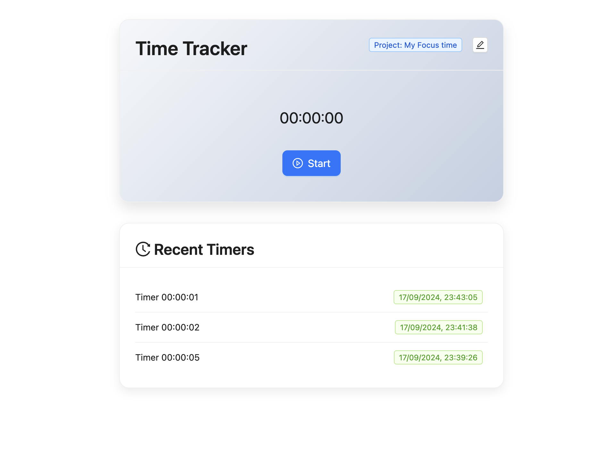

## Installation

To install and run this project locally, follow these steps:

1. **Clone the repository:**
   ```bash
   git clone https://github.com/AzarguNazari/timer.git
   cd timer
   ```

2. **Install dependencies:**
   ```bash
   npm install
   ```

3. **Start the development server:**
   ```bash
   npm start
   ```

The app will be available at `http://localhost:3000/`.


